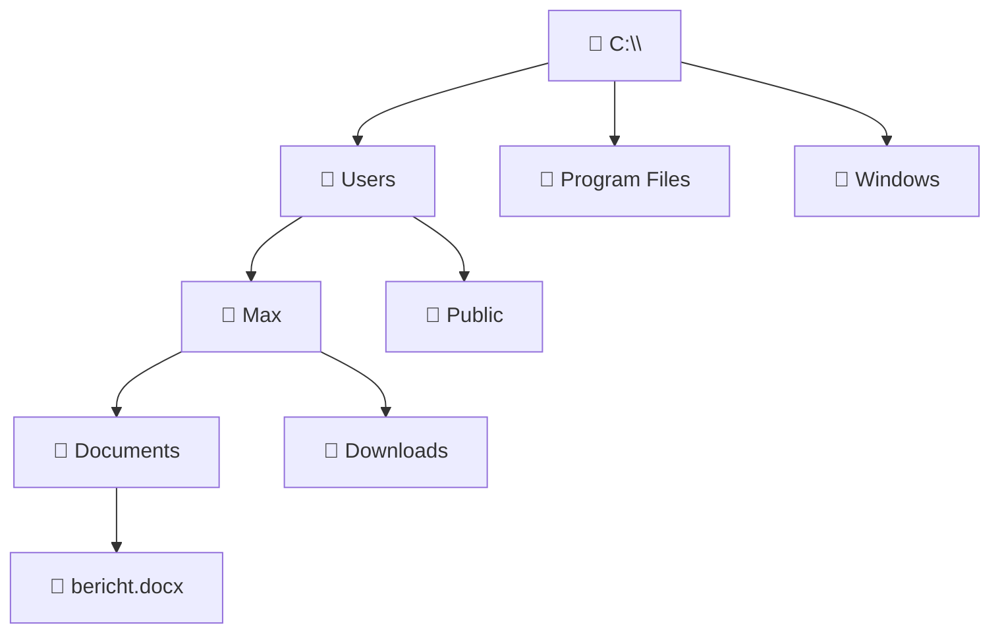
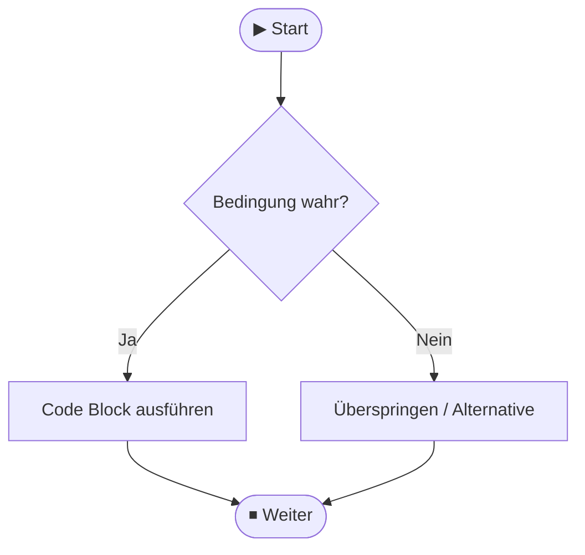
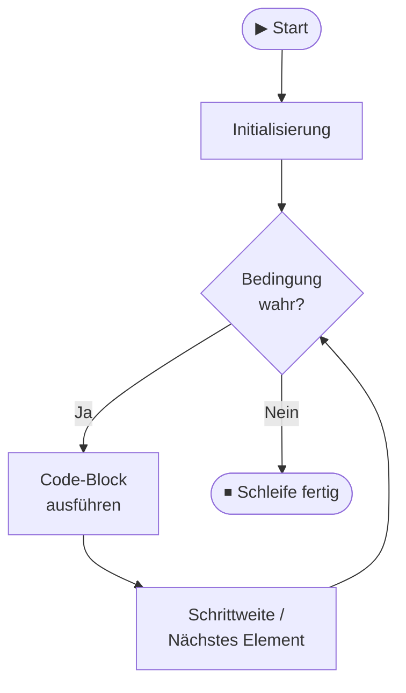
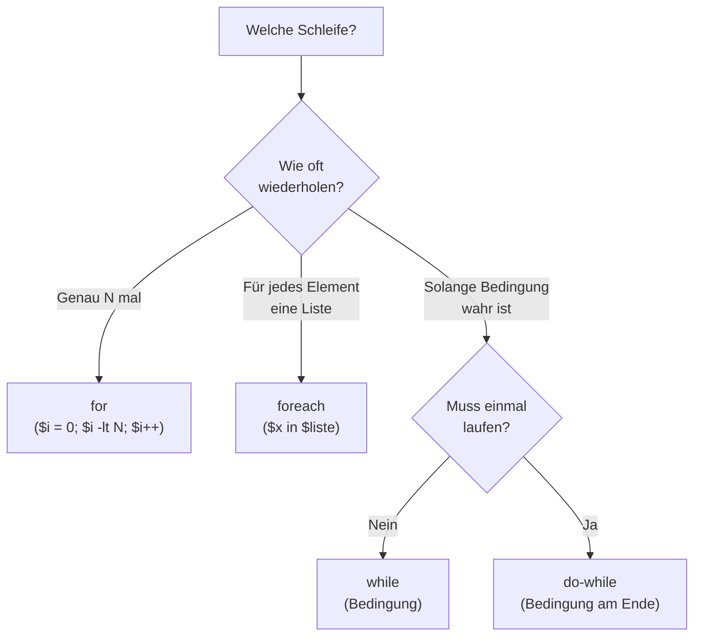
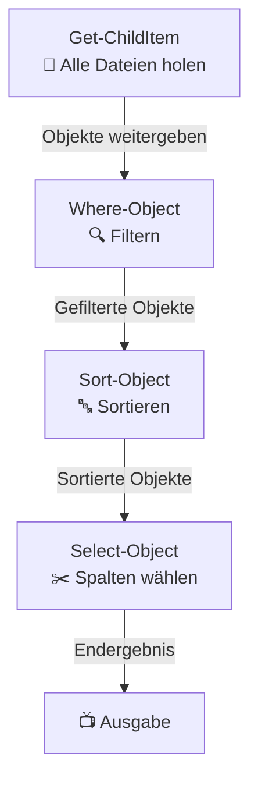
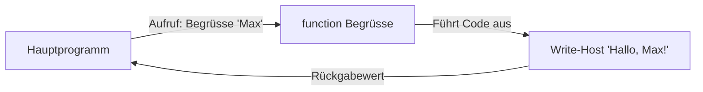
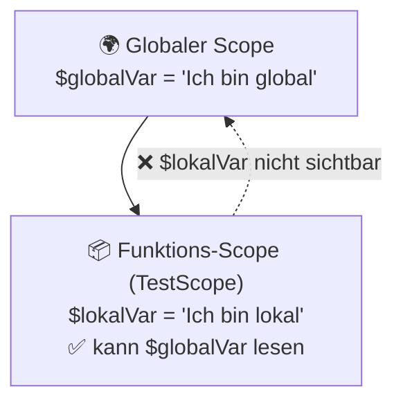

# M122 – PowerShell: Abläufe mit einer Scriptsprache automatisieren
> Lerninhalt für die IT-Lernplattform | Basiert auf Modul 122 Grundlagen
> Struktur: 5 Inhaltsblöcke + Quizfragen (bereit zum Einfügen in HTML)

---

## ──────────────────────────────────────
## BLOCK 1 – Windows Terminal & PowerShell Grundlagen
## ──────────────────────────────────────

### Was ist PowerShell?

PowerShell ist eine **Befehlszeile und Scriptsprache** von Microsoft. Im Gegensatz zur alten Eingabeaufforderung (`cmd.exe`) ist PowerShell viel mächtiger: Sie kann nicht nur Befehle ausführen, sondern auch Programme schreiben, Dateien bearbeiten, Windows-Einstellungen ändern und vieles mehr automatisieren.

> **Merkhilfe:** CMD = einfaches Werkzeug. PowerShell = komplettes Werkzeugset.

**Vergleich CMD vs. PowerShell:**

| Merkmal             | CMD (`cmd.exe`)           | PowerShell                          |
|---------------------|---------------------------|--------------------------------------|
| Erscheinungsjahr    | 1987                      | 2006                                 |
| Scripting           | Sehr eingeschränkt (Batch)| Vollständige Programmiersprache      |
| Objekte             | Nur Text-Output           | Gibt echte .NET-Objekte zurück       |
| Befehlsstruktur     | Kurze alte Befehle (`dir`)| `Verb-Substantiv` (z.B. `Get-Item`) |
| Plattform           | Nur Windows               | Windows, macOS, Linux                |

### PowerShell öffnen

Es gibt mehrere Wege, PowerShell zu starten:

1. **Windows + R** → `powershell` eingeben → Enter
2. **Suchleiste** → „PowerShell" eingeben → Rechtsklick → „Als Administrator ausführen"
3. **Windows Terminal** → Standardmässig PowerShell als Shell

> ⚠️ Manche Befehle (z.B. Systemänderungen) benötigen **Administrator-Rechte**. Erkennbar am Titel „Administrator: Windows PowerShell".

### Das Dateisystem verstehen

Windows organisiert Dateien in einer Baumstruktur. Alles beginnt bei einem **Laufwerk** (z.B. `C:`).

```
C:\
├── Users\
│   ├── Max\
│   │   ├── Documents\
│   │   │   └── bericht.docx
│   │   └── Downloads\
│   └── Public\
├── Program Files\
└── Windows\
```



### Pfade: Absolut vs. Relativ

Ein **Pfad** beschreibt den Ort einer Datei oder eines Ordners im System.

**Absoluter Pfad** – beginnt immer beim Laufwerk, beschreibt den kompletten Weg:
```
C:\Users\Max\Documents\bericht.docx
```

**Relativer Pfad** – beschreibt den Weg **ab dem aktuellen Ordner**:

| Symbol | Bedeutung                     | Beispiel                       |
|--------|-------------------------------|--------------------------------|
| `.`    | Aktueller Ordner              | `.\bericht.docx`               |
| `..`   | Übergeordneter Ordner (hoch)  | `..\Downloads\datei.zip`       |
| `~`    | Home-Verzeichnis des Benutzers| `~\Documents\`                 |

**Beispiel:** Du bist im Ordner `C:\Users\Max\Documents\` und willst die Datei in Downloads öffnen:
```powershell
# Absoluter Pfad – funktioniert immer
Get-Item "C:\Users\Max\Downloads\datei.zip"

# Relativer Pfad – nur korrekt wenn du in Documents bist
Get-Item "..\Downloads\datei.zip"
```

### Navigation im Terminal

Der wichtigste Befehl: Wo bin ich gerade?

```powershell
# Zeigt den aktuellen Ordner an (= "Print Working Directory")
Get-Location
# Kurzform: pwd
```

**Ordner wechseln mit `Set-Location` (Alias: `cd`):**

```powershell
# In einen Unterordner wechseln
Set-Location Documents
# oder kurz:
cd Documents

# Mit absolutem Pfad
cd C:\Users\Max\Downloads

# Einen Ordner höher (raus)
cd ..

# Direkt ins Home-Verzeichnis
cd ~
```

**Ordnerinhalt anzeigen mit `Get-ChildItem` (Alias: `ls` oder `dir`):**

```powershell
# Aktuellen Ordner anzeigen
Get-ChildItem
# oder kurz:
ls

# Anderen Ordner anzeigen
ls C:\Users\Max\Documents

# Versteckte Dateien auch anzeigen
ls -Force

# Nur .txt Dateien anzeigen
ls *.txt
```

### Wichtige Grundbefehle

| Aktion                   | Befehl (lang)        | Alias    | Beispiel                              |
|--------------------------|----------------------|----------|---------------------------------------|
| Aktueller Pfad anzeigen  | `Get-Location`       | `pwd`    | `pwd`                                 |
| Ordner wechseln          | `Set-Location`       | `cd`     | `cd C:\Users`                         |
| Inhalt anzeigen          | `Get-ChildItem`      | `ls`     | `ls .\Dokumente`                      |
| Ordner erstellen         | `New-Item -ItemType Directory` | `mkdir` | `mkdir NeuerOrdner`        |
| Datei erstellen          | `New-Item -ItemType File` | –   | `New-Item test.txt -ItemType File`    |
| Datei lesen              | `Get-Content`        | `cat`    | `cat .\readme.txt`                    |
| Datei kopieren           | `Copy-Item`          | `cp`     | `cp datei.txt C:\Backup\`             |
| Datei verschieben        | `Move-Item`          | `mv`     | `mv alt.txt neu.txt`                  |
| Datei löschen            | `Remove-Item`        | `rm`     | `rm datei.txt`                        |
| Bildschirm leeren        | `Clear-Host`         | `cls`    | `cls`                                 |
| Hilfe zu einem Befehl    | `Get-Help`           | –        | `Get-Help Get-ChildItem`              |

> 💡 **Tipp:** PowerShell-Befehle folgen dem Schema `Verb-Substantiv` (z.B. `Get-Item`, `New-Folder`, `Remove-File`). Das macht sie leichter zu erraten als alte CMD-Befehle.

---

### 🧩 Mini-Quiz: Block 1

**Frage 1:** Was ist der Unterschied zwischen einem absoluten und einem relativen Pfad?
- A) Es gibt keinen Unterschied
- B) **Ein absoluter Pfad beginnt beim Laufwerk (z.B. C:\), ein relativer Pfad beim aktuellen Ordner** ✅
- C) Ein relativer Pfad ist kürzer, ein absoluter länger
- D) Absolute Pfade funktionieren nur in CMD

*Erklärung: Absolute Pfade beginnen immer beim Laufwerk (C:\...) und funktionieren unabhängig vom aktuellen Ordner. Relative Pfade (.\, ..\) sind abhängig davon, wo man sich gerade befindet.*

**Frage 2:** Mit welchem PowerShell-Befehl wechselst du in den übergeordneten Ordner?
- A) `cd home`
- B) `go up`
- C) `cd /`
- D) **`cd ..`** ✅

*Erklärung: `..` steht für "einen Ordner höher". `cd ..` ist sowohl in CMD als auch in PowerShell gültig (Alias für `Set-Location ..`).*

**Frage 3:** Welches Muster folgen PowerShell-Befehle typischerweise?
- A) Kurze 2-3 Buchstaben wie `ls`, `cd`, `rm`
- B) Englische Verben ohne Substantiv
- C) **`Verb-Substantiv` – zum Beispiel `Get-Item`, `New-Item`, `Remove-Item`** ✅
- D) Grossbuchstaben wie `GETITEM`

*Erklärung: PowerShell verwendet konsistent das Schema Verb-Substantiv (Get-ChildItem, Copy-Item, Remove-Item...). Das macht Befehle vorhersehbar – oft kann man den richtigen Befehl erraten.*

---

## ──────────────────────────────────────
## BLOCK 2 – Variablen & Datentypen
## ──────────────────────────────────────

### Was ist eine Variable?

Eine Variable ist ein **benannter Speicherplatz** im Arbeitsspeicher. Du kannst darin einen Wert ablegen, ihn später wieder abrufen oder verändern. In PowerShell beginnen Variablen immer mit dem `$`-Zeichen.

```powershell
# Variable erstellen und Wert zuweisen
$name = "Max"
$alter = 17
$istLernender = $true

# Variable verwenden
Write-Host "Hallo, $name!"
# Ausgabe: Hallo, Max!
```

> **Merkhilfe:** Das `$` zeigt PowerShell: "Das hier ist eine Variable, nicht ein normaler Text."

### Datentypen

PowerShell erkennt Datentypen automatisch (sogenanntes **Type Inference**). Du musst den Typ nicht angeben – PowerShell wählt ihn selbst.

| Datentyp    | PowerShell-Typ | Beispiel                         | Beschreibung                      |
|-------------|----------------|----------------------------------|-----------------------------------|
| Text        | `[string]`     | `$name = "Max"`                 | Zeichenkette in Anführungszeichen |
| Ganzzahl    | `[int]`        | `$alter = 17`                    | Positive und negative Ganzzahlen  |
| Dezimalzahl | `[double]`     | `$preis = 19.90`                 | Zahl mit Nachkommastellen         |
| Wahrheitswert| `[bool]`      | `$aktiv = $true`                 | Nur `$true` oder `$false`         |
| Array       | `[array]`      | `$farben = @("Rot","Grün","Blau")`| Liste von Werten                 |
| Hashtable   | `[hashtable]`  | `$person = @{Name="Max"; Alter=17}` | Schlüssel-Wert-Paare         |

**Typ einer Variable prüfen:**

```powershell
$zahl = 42
$zahl.GetType().Name
# Ausgabe: Int32

$text = "Hallo"
$text.GetType().Name
# Ausgabe: String
```

**Typ erzwingen (Type Casting):**

```powershell
# PowerShell interpretiert "5" als String – wir wollen aber eine Zahl
$eingabe = "5"
$zahl = [int]$eingabe
$zahl + 3
# Ausgabe: 8  (nicht "53"!)
```

### String-Typen: Doppelte vs. einfache Anführungszeichen

Das ist ein häufiger Fehler für Einsteiger – es gibt einen wichtigen Unterschied:

```powershell
$name = "Max"

# Doppelte Anführungszeichen → Variable wird AUFGELÖST (interpoliert)
Write-Host "Hallo, $name!"
# Ausgabe: Hallo, Max!

# Einfache Anführungszeichen → Text wird WÖRTLICH genommen
Write-Host 'Hallo, $name!'
# Ausgabe: Hallo, $name!
```

> **Regel:** `"..."` = Variable wird ersetzt. `'...'` = alles ist wörtlich.

**Nützliche String-Methoden:**

```powershell
$text = "hallo welt"

$text.ToUpper()          # HALLO WELT
$text.Length             # 10
$text.Replace("welt","powershell")   # hallo powershell
$text.Split(" ")         # @("hallo", "welt")
$text.StartsWith("hall") # True
```

### Arrays – Listen von Werten

```powershell
# Array erstellen
$farben = @("Rot", "Grün", "Blau")

# Auf einzelne Elemente zugreifen (Index beginnt bei 0!)
$farben[0]   # Rot
$farben[1]   # Grün
$farben[2]   # Blau
$farben[-1]  # Blau (letztes Element)

# Anzahl Elemente
$farben.Count   # 3

# Element hinzufügen
$farben += "Gelb"

# Alle Elemente ausgeben
$farben        # Gibt alle Farben aus
```

> **Merkhilfe:** Arrays in PowerShell beginnen immer bei Index **0**, nicht bei 1!

### Hashtables – Schlüssel-Wert-Paare

Eine Hashtable ist wie ein Mini-Formular: Jeder Eintrag hat einen **Namen (Schlüssel)** und einen **Wert**.

```powershell
# Hashtable erstellen
$person = @{
    Name    = "Max"
    Alter   = 17
    Klasse  = "INP25b"
}

# Wert lesen
$person["Name"]    # Max
$person.Alter      # 17

# Wert ändern
$person["Klasse"] = "INP26a"

# Neuen Eintrag hinzufügen
$person["Schule"] = "BBZW"

# Alle Einträge anzeigen
$person
```

---

### 🧩 Mini-Quiz: Block 2

**Frage 1:** Wie erstellt man in PowerShell eine Variable mit dem Wert 42?
- A) `var zahl = 42`
- B) `zahl := 42`
- C) **`$zahl = 42`** ✅
- D) `int zahl = 42`

*Erklärung: In PowerShell beginnen alle Variablen mit dem $-Zeichen. Der Wert wird mit = zugewiesen. PowerShell erkennt den Typ automatisch.*

**Frage 2:** Was ist der Unterschied zwischen `"$name"` und `'$name'` in PowerShell?
- A) Es gibt keinen Unterschied
- B) Einfache Anführungszeichen sind schneller
- C) **Mit doppelten Anführungszeichen wird die Variable aufgelöst, mit einfachen wird sie wörtlich ausgegeben** ✅
- D) Variablen funktionieren nur mit einfachen Anführungszeichen

*Erklärung: `"Hallo $name"` → gibt "Hallo Max" aus. `'Hallo $name'` → gibt "Hallo $name" aus. Doppelte Anführungszeichen = Interpolation.*

**Frage 3:** Bei welchem Index beginnt ein Array in PowerShell?
- A) Bei 1
- B) Bei -1
- C) Hängt vom Datentyp ab
- D) **Bei 0** ✅

*Erklärung: In PowerShell (und fast allen Programmiersprachen) beginnt der Index bei 0. Das erste Element ist also $array[0], das zweite $array[1] usw.*

---

## ──────────────────────────────────────
## BLOCK 3 – Kontrollstrukturen (if / elseif / else / switch)
## ──────────────────────────────────────

### Was sind Kontrollstrukturen?

Ohne Kontrollstrukturen läuft ein Skript immer von oben nach unten – Zeile für Zeile, ohne Ausnahme. Mit Kontrollstrukturen kann ein Skript **Entscheidungen treffen**: Führe diesen Code nur aus, *wenn* eine bestimmte Bedingung erfüllt ist.



### if / elseif / else

```powershell
$alter = 17

if ($alter -ge 18) {
    Write-Host "Du bist volljährig."
}
elseif ($alter -ge 16) {
    Write-Host "Du bist fast volljährig (16-17)."
}
else {
    Write-Host "Du bist noch minderjährig."
}
# Ausgabe: Du bist fast volljährig (16-17).
```

**Aufbau:**
- `if (Bedingung) { ... }` → wird ausgeführt wenn Bedingung = `$true`
- `elseif (andere Bedingung) { ... }` → wird geprüft wenn das `if` `$false` war
- `else { ... }` → wird ausgeführt wenn **keine** der Bedingungen zutraf

> **Wichtig:** Es wird immer nur **ein** Block ausgeführt – der erste, dessen Bedingung zutrifft. Danach wird der Rest übersprungen.

### Vergleichsoperatoren

In PowerShell verwendet man **keine** `==`, `>`, `<` für Vergleiche (wie in anderen Sprachen), sondern spezielle Operatoren:

| Operator  | Bedeutung              | Beispiel                | Ergebnis  |
|-----------|------------------------|-------------------------|-----------|
| `-eq`     | Gleich (Equal)         | `5 -eq 5`               | `$true`   |
| `-ne`     | Ungleich (Not Equal)   | `5 -ne 3`               | `$true`   |
| `-gt`     | Grösser als (Greater)  | `10 -gt 7`              | `$true`   |
| `-lt`     | Kleiner als (Less)     | `3 -lt 8`               | `$true`   |
| `-ge`     | Grösser gleich         | `5 -ge 5`               | `$true`   |
| `-le`     | Kleiner gleich         | `4 -le 5`               | `$true`   |
| `-like`   | Muster-Vergleich       | `"Max" -like "A*"`     | `$true`   |
| `-match`  | Regex-Vergleich        | `"abc" -match "[a-z]+"` | `$true`   |

> **Merkhilfe:** Die Abkürzungen sind englisch: eq = equal, ne = not equal, gt = greater than, lt = less than, ge = greater or equal, le = less or equal.

### Logische Operatoren

Mehrere Bedingungen lassen sich kombinieren:

```powershell
$alter = 17
$hatAusweis = $true

if ($alter -ge 18 -and $hatAusweis) {
    Write-Host "Zutritt erlaubt"
}

if ($alter -lt 16 -or $hatAusweis -eq $false) {
    Write-Host "Zutritt verweigert"
}

# Negation
if (-not $hatAusweis) {
    Write-Host "Kein Ausweis vorhanden"
}
```

| Operator | Bedeutung                                  |
|----------|--------------------------------------------|
| `-and`   | Beide Bedingungen müssen wahr sein         |
| `-or`    | Mindestens eine Bedingung muss wahr sein   |
| `-not`   | Kehrt den Wahrheitswert um (`$true` → `$false`) |

### switch – Viele Fälle elegant

Wenn man viele `if/elseif`-Fälle hat, ist `switch` übersichtlicher:

```powershell
$tag = "Montag"

switch ($tag) {
    "Montag"     { Write-Host "Wochenbeginn – viel Erfolg!" }
    "Freitag"    { Write-Host "Fast Wochenende!" }
    "Samstag"    { Write-Host "Wochenende 🎉" }
    "Sonntag"    { Write-Host "Wochenende 🎉" }
    default      { Write-Host "Ein normaler Wochentag." }
}
# Ausgabe: Wochenbeginn – viel Erfolg!
```

> `default` ist der "Auffang-Fall" – er wird ausgeführt wenn kein anderer Fall passt. Entspricht dem `else` beim if.

**switch mit Zahlen und Bereichen:**

```powershell
$note = 4

switch ($note) {
    6       { Write-Host "Ausgezeichnet!" }
    5       { Write-Host "Sehr gut!" }
    4       { Write-Host "Genügend." }
    default { Write-Host "Nicht genügend." }
}
```

---

### 🧩 Mini-Quiz: Block 3

**Frage 1:** Welcher Operator prüft in PowerShell ob zwei Werte gleich sind?
- A) `==`
- B) `===`
- C) **`-eq`** ✅
- D) `=`

*Erklärung: In PowerShell verwendet man -eq (equal) statt ==. Das einfache = ist nur für Zuweisungen (z.B. $x = 5).*

**Frage 2:** Was macht der `-and` Operator in einer Bedingung?
- A) Verbindet zwei Strings zu einem
- B) Prüft ob mindestens eine Bedingung wahr ist
- C) **Beide Bedingungen müssen wahr sein damit der Gesamtausdruck wahr ist** ✅
- D) Gibt die Summe zweier Zahlen zurück

*Erklärung: Bei -and müssen BEIDE Seiten $true sein. Wenn auch nur eine Seite $false ist, ist das Gesamtergebnis $false. Für "mindestens eine" verwendet man -or.*

**Frage 3:** Wofür ist der `default`-Block in einer switch-Anweisung?
- A) Er wird immer als erstes ausgeführt
- B) Er definiert den Standard-Datentyp
- C) Er löscht alle anderen Fälle
- D) **Er wird ausgeführt wenn kein anderer Fall übereinstimmt – entspricht dem `else`** ✅

*Erklärung: `default` ist der Auffang-Fall im switch – er greift, wenn keiner der definierten Fälle passt. Er ist optional, aber eine gute Praxis.*

---

## ──────────────────────────────────────
## BLOCK 4 – Schleifen (for / foreach / while)
## ──────────────────────────────────────

### Was sind Schleifen?

Schleifen ermöglichen es, **Code mehrfach auszuführen** – ohne ihn mehrfach hinschreiben zu müssen. Sobald eine Bedingung nicht mehr erfüllt ist (oder alle Elemente durchlaufen wurden), stoppt die Schleife.



### for-Schleife – Zählerschleife

Die `for`-Schleife wird verwendet, wenn man **genau weiss, wie oft** etwas wiederholt werden soll.

```powershell
# Struktur: for (Start; Bedingung; Schritt)
for ($i = 0; $i -lt 5; $i++) {
    Write-Host "Durchlauf Nummer $i"
}
# Ausgabe:
# Durchlauf Nummer 0
# Durchlauf Nummer 1
# Durchlauf Nummer 2
# Durchlauf Nummer 3
# Durchlauf Nummer 4
```

**Die drei Teile der for-Schleife:**

| Teil            | Beispiel    | Bedeutung                         |
|-----------------|-------------|-----------------------------------|
| Initialisierung | `$i = 0`    | Startwert der Zählvariable        |
| Bedingung       | `$i -lt 5`  | Schleife läuft solange dies wahr ist |
| Schritt         | `$i++`      | Was nach jedem Durchlauf passiert |

> **`$i++`** ist eine Kurzform für `$i = $i + 1` (Zähler um 1 erhöhen). `$i--` zählt entsprechend rückwärts.

### foreach-Schleife – Durch Listen iterieren

Die `foreach`-Schleife geht **jedes Element einer Liste** der Reihe nach durch – ideal für Arrays.

```powershell
$farben = @("Rot", "Grün", "Blau", "Gelb")

foreach ($farbe in $farben) {
    Write-Host "Farbe: $farbe"
}
# Ausgabe:
# Farbe: Rot
# Farbe: Grün
# Farbe: Blau
# Farbe: Gelb
```

**Praktisches Beispiel – Dateien verarbeiten:**

```powershell
# Alle .txt-Dateien im aktuellen Ordner ausgeben
$dateien = Get-ChildItem -Filter "*.txt"

foreach ($datei in $dateien) {
    Write-Host "Datei gefunden: $($datei.Name)"
}
```

> **Tipp:** `$($datei.Name)` – die `$(...)`-Klammern ermöglichen komplexere Ausdrücke innerhalb eines Strings.

### while-Schleife – Solange-Schleife

Die `while`-Schleife läuft, **solange** eine Bedingung wahr ist. Sie wird verwendet, wenn man nicht weiss wie oft die Schleife laufen wird.

```powershell
$zahl = 1

while ($zahl -le 5) {
    Write-Host "Zahl: $zahl"
    $zahl++
}
# Ausgabe:
# Zahl: 1
# Zahl: 2
# Zahl: 3
# Zahl: 4
# Zahl: 5
```

> ⚠️ **Endlosschleife vermeiden!** Wenn die Bedingung immer `$true` bleibt, läuft die Schleife für immer. Immer sicherstellen, dass die Bedingung irgendwann `$false` wird. Mit `Ctrl+C` kann man eine Endlosschleife abbrechen.

### do-while-Schleife – Mindestens einmal

Die `do-while`-Schleife wird **mindestens einmal** ausgeführt – die Bedingung wird erst **am Ende** geprüft.

```powershell
do {
    $eingabe = Read-Host "Bitte eine Zahl zwischen 1 und 10 eingeben"
    $eingabe = [int]$eingabe
} while ($eingabe -lt 1 -or $eingabe -gt 10)

Write-Host "Deine Eingabe: $eingabe"
```

> Der Unterschied zu `while`: Bei `while` wird die Bedingung **vor** dem ersten Durchlauf geprüft – es ist möglich, dass der Code-Block gar nie ausgeführt wird. Bei `do-while` läuft der Block **mindestens einmal**.

### Vergleich der Schleifen-Typen



### break und continue

Manchmal möchte man eine Schleife **vorzeitig beenden** oder einen Durchlauf **überspringen**:

```powershell
# break – Schleife sofort beenden
for ($i = 0; $i -lt 10; $i++) {
    if ($i -eq 5) { break }
    Write-Host $i
}
# Ausgabe: 0 1 2 3 4

# continue – Aktuellen Durchlauf überspringen, weiter mit dem nächsten
for ($i = 0; $i -lt 6; $i++) {
    if ($i -eq 3) { continue }
    Write-Host $i
}
# Ausgabe: 0 1 2 4 5
```

---

### 🧩 Mini-Quiz: Block 4

**Frage 1:** Welche Schleife eignet sich am besten um **jedes Element eines Arrays** zu verarbeiten?
- A) while
- B) do-while
- C) for
- D) **foreach** ✅

*Erklärung: foreach ($element in $array) geht automatisch durch jedes Element. Man muss sich nicht um Indizes oder Zähler kümmern.*

**Frage 2:** Was ist der Unterschied zwischen `while` und `do-while`?
- A) Es gibt keinen Unterschied
- B) while ist schneller
- C) **Bei `do-while` wird der Code-Block mindestens einmal ausgeführt, bei `while` kann er auch 0-mal laufen** ✅
- D) `do-while` läuft immer genau zweimal

*Erklärung: while prüft die Bedingung VOR dem ersten Durchlauf – ist sie von Anfang an $false, läuft der Block nie. do-while prüft erst AM ENDE, also läuft er mindestens einmal.*

**Frage 3:** Was macht `break` innerhalb einer Schleife?
- A) Pausiert die Schleife kurz
- B) Überspringt den aktuellen Durchlauf und macht mit dem nächsten weiter
- C) Gibt einen Fehler aus
- D) **Beendet die Schleife sofort, auch wenn die Bedingung noch wahr wäre** ✅

*Erklärung: break bricht die Schleife vollständig ab. continue hingegen überspringt nur den aktuellen Durchlauf und macht mit dem nächsten weiter.*

---

## ──────────────────────────────────────
## BLOCK 5 – Die Pipeline (Pipes)
## ──────────────────────────────────────

### Was ist eine Pipeline?

Die Pipeline ist eines der **mächtigsten Features** von PowerShell. Mit dem Pipe-Zeichen `|` kann die Ausgabe eines Befehls direkt als Eingabe an den nächsten Befehl weitergegeben werden – wie ein Förderband in einer Fabrik.



**Ohne Pipeline** – umständlich, alles in Variablen zwischenspeichern:
```powershell
$alle    = Get-ChildItem
$gross   = $alle | Where-Object { $_.Length -gt 1MB }
$sortiert = $gross | Sort-Object Length -Descending
```

**Mit Pipeline** – elegant, alles in einer Zeile:
```powershell
Get-ChildItem | Where-Object { $_.Length -gt 1MB } | Sort-Object Length -Descending
```

> **Merkhilfe:** Stell dir die Pipeline wie Wasserrohre vor – Wasser fliesst von Rohr zu Rohr, und jedes Rohr kann das Wasser filtern, umleiten oder verändern.

### Das `$_`-Zeichen – das aktuelle Objekt

In Pipeline-Befehlen steht `$_` für das **aktuelle Objekt**, das gerade durch die Pipeline fliesst – also das Element, das gerade bearbeitet wird.

```powershell
# $_ = die Datei, die gerade betrachtet wird
Get-ChildItem | Where-Object { $_.Name -like "*.txt" }
#                                  ↑
#                           $_ = aktuelle Datei
```

> **Alternativ:** Ab PowerShell 3 kann man auch `$PSItem` statt `$_` schreiben – beide bedeuten dasselbe.

### Where-Object – Filtern

`Where-Object` filtert die Objekte der Pipeline anhand einer Bedingung. Nur Objekte, bei denen die Bedingung `$true` ergibt, kommen durch.

```powershell
# Nur laufende Prozesse die mehr als 100MB RAM nutzen
Get-Process | Where-Object { $_.WorkingSet -gt 100MB }

# Nur .log-Dateien
Get-ChildItem C:\Logs | Where-Object { $_.Extension -eq ".log" }

# Nur Dienste die gerade laufen
Get-Service | Where-Object { $_.Status -eq "Running" }

# Kurzform mit -FilterScript (ab PS 3)
Get-Service | Where-Object Status -eq "Running"
```

### Select-Object – Spalten auswählen

`Select-Object` wählt aus, **welche Eigenschaften (Spalten)** angezeigt werden sollen – oder beschränkt die Anzahl Ergebnisse.

```powershell
# Nur Name und Grösse der Dateien anzeigen
Get-ChildItem | Select-Object Name, Length

# Nur die ersten 5 Ergebnisse
Get-Process | Select-Object -First 5

# Nur das letzte Element
Get-ChildItem | Select-Object -Last 1

# Duplikate entfernen
@("Rot", "Grün", "Rot", "Blau") | Select-Object -Unique
```

### Sort-Object – Sortieren

`Sort-Object` sortiert die Objekte nach einer oder mehreren Eigenschaften.

```powershell
# Prozesse nach CPU-Verbrauch sortieren (aufsteigend)
Get-Process | Sort-Object CPU

# Dateien nach Grösse sortieren (absteigend = grösste zuerst)
Get-ChildItem | Sort-Object Length -Descending

# Nach mehreren Spalten sortieren
Get-ChildItem | Sort-Object Extension, Name
```

### ForEach-Object – Für jedes Objekt etwas tun

`ForEach-Object` ist die Pipeline-Version der `foreach`-Schleife. Für jedes Objekt in der Pipeline wird ein Code-Block ausgeführt.

```powershell
# Alle Dateinamen in Grossbuchstaben ausgeben
Get-ChildItem | ForEach-Object { $_.Name.ToUpper() }

# Dateien umbenennen – "_alt" am Ende anhängen
Get-ChildItem *.txt | ForEach-Object {
    Rename-Item $_.FullName ($_.BaseName + "_alt" + $_.Extension)
}

# Kurzform mit dem Alias %
1..5 | % { Write-Host "Zahl: $_" }
# Ausgabe: Zahl: 1, Zahl: 2, Zahl: 3, Zahl: 4, Zahl: 5
```

> **Alias:** `ForEach-Object` kann als `%` abgekürzt werden. `Where-Object` kann als `?` abgekürzt werden.

### Measure-Object – Zählen und berechnen

`Measure-Object` führt **Berechnungen** über die Pipeline-Objekte durch: Anzahl, Summe, Minimum, Maximum, Durchschnitt.

```powershell
# Anzahl Dateien im Ordner
Get-ChildItem | Measure-Object
# → Count: 12

# Gesamtgrösse aller Dateien in Bytes
Get-ChildItem | Measure-Object -Property Length -Sum
# → Sum: 4823040

# Min, Max, Durchschnitt der Dateigrössen
Get-ChildItem | Measure-Object -Property Length -Min -Max -Average
```

### Ausgabe umleiten

Die Pipeline kann auch in Dateien oder andere Ausgaben umgeleitet werden:

```powershell
# Ergebnis in eine Datei schreiben
Get-Process | Out-File C:\prozesse.txt

# Ergebnis als CSV exportieren
Get-Process | Export-Csv C:\prozesse.csv -NoTypeInformation

# Interaktive Tabelle (GUI) öffnen
Get-Process | Out-GridView

# Ergebnis in der Konsole als formatierte Tabelle anzeigen
Get-Service | Format-Table Name, Status, StartType
```

### Alles kombiniert – ein reales Beispiel

```powershell
# Finde die 5 grössten Dateien im Windows-Ordner,
# die grösser als 10MB sind, sortiert nach Grösse
Get-ChildItem C:\Windows -Recurse -ErrorAction SilentlyContinue |
    Where-Object  { $_.Length -gt 10MB } |
    Sort-Object     Length -Descending |
    Select-Object   Name, @{Name="Grösse MB"; Expression={[math]::Round($_.Length/1MB,1)}} |
    Select-Object  -First 5
```

**Was passiert hier Schritt für Schritt:**

| Schritt | Befehl | Was er macht |
|---------|--------|--------------|
| 1 | `Get-ChildItem ... -Recurse` | Holt alle Dateien rekursiv |
| 2 | `Where-Object { $_.Length -gt 10MB }` | Behält nur Dateien > 10MB |
| 3 | `Sort-Object Length -Descending` | Sortiert nach Grösse (grösste zuerst) |
| 4 | `Select-Object Name, ...` | Zeigt nur Name + Grösse in MB |
| 5 | `Select-Object -First 5` | Nimmt nur die ersten 5 |

---

### 🧩 Mini-Quiz: Block 5

**Frage 1:** Was bewirkt das Pipe-Zeichen `|` in PowerShell?
- A) Es ist ein mathematischer Oder-Operator
- B) **Es leitet die Ausgabe eines Befehls als Eingabe an den nächsten Befehl weiter** ✅
- C) Es öffnet eine neue PowerShell-Sitzung
- D) Es kommentiert den Rest der Zeile aus

*Erklärung: Mit | (Pipe) wird das Ergebnis eines Befehls direkt an den nächsten weitergegeben – wie ein Förderband. `Get-Process | Where-Object {...}` gibt alle Prozesse an Where-Object weiter, das dann filtert.*

**Frage 2:** Wofür steht `$_` in einem Pipeline-Ausdruck?
- A) Für die gesamte Pipeline
- B) Für die Anzahl der Elemente
- C) Für einen Fehler
- D) **Für das aktuelle Objekt, das gerade durch die Pipeline fliesst** ✅

*Erklärung: $_ (oder $PSItem) repräsentiert das Element, das gerade verarbeitet wird. Bei `Get-ChildItem | Where-Object { $_.Name -like "*.txt" }` steht $_ für die aktuelle Datei.*

**Frage 3:** Welcher Befehl filtert Objekte in der Pipeline anhand einer Bedingung?
- A) `Sort-Object`
- B) `Select-Object`
- C) `Measure-Object`
- D) **`Where-Object`** ✅

*Erklärung: Where-Object lässt nur Objekte durch, bei denen die Bedingung $true ergibt – ähnlich wie WHERE in SQL. Sort-Object sortiert, Select-Object wählt Spalten aus.*

---

## ──────────────────────────────────────
## BLOCK 6 – Funktionen
## ──────────────────────────────────────

### Was ist eine Funktion?

Eine Funktion ist ein **wiederverwendbarer Code-Block**, dem man einen Namen gibt. Statt denselben Code mehrfach zu schreiben, schreibt man ihn einmal als Funktion – und ruft ihn dann so oft ab wie nötig.



**Ohne Funktion (schlecht – Code-Wiederholung):**
```powershell
Write-Host "Hallo, Max!"
Write-Host "Hallo, Milan!"
Write-Host "Hallo, Marvin!"
```

**Mit Funktion (besser – einmal schreiben, mehrfach nutzen):**
```powershell
function Begrüsse($name) {
    Write-Host "Hallo, $name!"
}

Begrüsse "Max"
Begrüsse "Milan"
Begrüsse "Marvin"
```

### Einfache Funktion

```powershell
# Funktion definieren
function ZeigeDatum {
    $datum = Get-Date -Format "dd.MM.yyyy"
    Write-Host "Heute ist: $datum"
}

# Funktion aufrufen (einfach den Namen schreiben)
ZeigeDatum
# Ausgabe: Heute ist: 27.05.2026
```

> Wichtig: Die Funktion muss **vor** dem Aufruf definiert werden (weiter oben im Skript).

### Funktionen mit Parametern

Parameter machen Funktionen flexibel – sie empfangen Werte von aussen:

```powershell
# Funktion mit Parametern
function Addiere($zahl1, $zahl2) {
    $ergebnis = $zahl1 + $zahl2
    Write-Host "$zahl1 + $zahl2 = $ergebnis"
}

Addiere 5 3
# Ausgabe: 5 + 3 = 8

Addiere 100 200
# Ausgabe: 100 + 200 = 300
```

### param() – Professionelle Parameter-Definition

Für sauberere Funktionen verwendet man den `param()`-Block. Damit können Standardwerte und Typen angegeben werden:

```powershell
function BerechneMwst {
    param(
        [double]$betrag,
        [double]$mwstSatz = 7.7   # Standardwert: 7.7% (Schweiz)
    )
    $mwst = $betrag * ($mwstSatz / 100)
    $total = $betrag + $mwst
    Write-Host "Netto: CHF $betrag"
    Write-Host "MwSt ($mwstSatz%): CHF $([math]::Round($mwst, 2))"
    Write-Host "Total: CHF $([math]::Round($total, 2))"
}

BerechneMwst -betrag 100
# Ausgabe:
# Netto: CHF 100
# MwSt (7.7%): CHF 7.7
# Total: CHF 107.7

# Anderen MwSt-Satz angeben
BerechneMwst -betrag 200 -mwstSatz 2.5
```

### return – Wert zurückgeben

Funktionen können auch **Werte zurückgeben**, die man weiterverarbeiten kann:

```powershell
function KwadratBerechnen($zahl) {
    return $zahl * $zahl
}

$ergebnis = KwadratBerechnen 6
Write-Host "6 hoch 2 = $ergebnis"
# Ausgabe: 6 hoch 2 = 36

# Den Rückgabewert direkt in einer Rechnung nutzen
$summe = (KwadratBerechnen 3) + (KwadratBerechnen 4)
Write-Host "3² + 4² = $summe"
# Ausgabe: 3² + 4² = 25
```

### Variable Scope (Gültigkeitsbereich)

Variablen haben einen **Gültigkeitsbereich (Scope)**: Sie existieren nur dort, wo sie definiert wurden.

```powershell
$globalVar = "Ich bin global"

function TestScope {
    $lokalVar = "Ich bin lokal"
    Write-Host $globalVar    # ✅ Funktioniert – globale Variable sichtbar
    Write-Host $lokalVar     # ✅ Funktioniert – lokale Variable sichtbar
}

TestScope
Write-Host $globalVar    # ✅ Funktioniert
Write-Host $lokalVar     # ❌ Fehler! $lokalVar existiert ausserhalb der Funktion nicht
```



> **Faustregel:** Variablen in einer Funktion sind nur innerhalb dieser Funktion sichtbar. Der globale Scope kann von überall gelesen werden.

### Zusammenfassung – Aufbau einer Funktion

```powershell
function FunktionsName {          # 1. Name der Funktion
    param(                         # 2. Parameter (optional)
        [Typ]$parameter1,
        [Typ]$parameter2 = Wert   # mit Standardwert
    )

    # 3. Code-Block
    $ergebnis = $parameter1 + $parameter2

    return $ergebnis               # 4. Rückgabewert (optional)
}

# 5. Aufruf
$wert = FunktionsName -parameter1 10 -parameter2 5
```

---

### 🧩 Mini-Quiz: Block 6

**Frage 1:** Wozu dienen Funktionen in PowerShell?
- A) Nur um mathematische Berechnungen durchzuführen
- B) Um Variablen zu löschen
- C) **Um wiederverwendbare Code-Blöcke zu erstellen, die man mit einem Namen aufrufen kann** ✅
- D) Funktionen gibt es in PowerShell nicht

*Erklärung: Funktionen fassen Code zusammen, geben ihm einen Namen und machen ihn wiederverwendbar. Statt denselben Code 10-mal zu schreiben, schreibt man eine Funktion und ruft sie 10-mal auf.*

**Frage 2:** Was macht `return` in einer Funktion?
- A) Beendet das gesamte Skript
- B) Gibt eine Fehlermeldung aus
- C) Springt an den Anfang der Funktion zurück
- D) **Gibt einen Wert aus der Funktion zurück, der weiterverwendet werden kann** ✅

*Erklärung: return gibt einen Wert zurück an die Stelle, die die Funktion aufgerufen hat. Dieser Wert kann in einer Variable gespeichert oder direkt weiterverwendet werden.*

**Frage 3:** Eine Variable wird innerhalb einer Funktion definiert. Wo ist sie sichtbar?
- A) Überall im Skript
- B) In allen Funktionen ausser der eigenen
- C) **Nur innerhalb der Funktion, in der sie definiert wurde** ✅
- D) Nur in Schleifen

*Erklärung: Variablen die in einer Funktion definiert werden, haben lokalen Scope – sie existieren nur innerhalb dieser Funktion. Ausserhalb sind sie nicht zugänglich.*

---


---

*Erstellt: 27.05.2026 | Quelle: Modul 122 – Abläufe mit einer Scriptsprache automatisieren*
*→ Nächster Schritt: Inhalte in `it-lernplattform.html` einfügen, quizData ergänzen*
